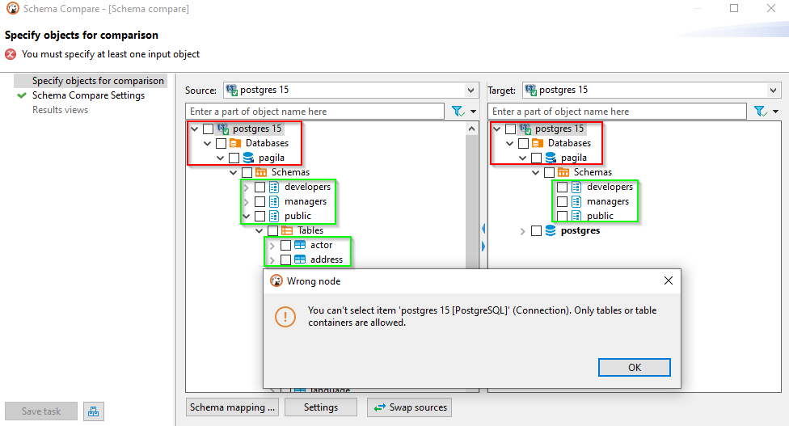
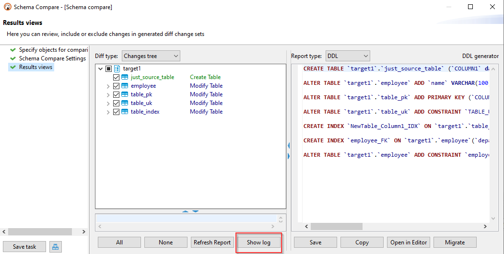
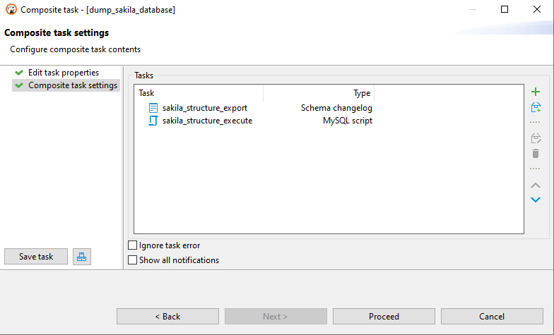

**NB: This feature is available in [Enterprise](Enterprise-Edition) and [Ultimate](Ultimate-Edition) editions only.**

### Databases supporting schema comparison
|||
|---------------|-------------|
|	Cockroach	|	Oracle	|
|	Databricks	|	PostgreSQL	|
|	DB2	|	Redshift	|
|	Derby	|	SAP HANA	|
|	EnterpriseDB	|	Snowflake	|
|	Firebird	|	SQLite	|
|	Greenplum	|	SQLServer	|
|	Informix	|	Teradata	|
|	MySQL/MariaDB	|	Vertica	|
|	Netezza	|	YugabyteDB	|

## How it works

You can compare two schema/database structures and generate a report in the following formats:
- DDL script (series of create/alter/drop statements)
- Diff diagram (sort of ER diagram)
- Liquibase changelog
- Liquibase change report (JSON, YAML, or plaintext)

### What is possible to compare

In most cases, you can compare **schemas, databases, or tables**. However, some databases (like SQLite and Firebird) do not have catalogs and schemes that can be selected for comparison. In this case (and only for these databases), it is possible to compare the entire **datasources**.

Usually, you can compare the following database objects: **columns, primary keys, foreign keys, indexes**, and so on (it depends on your database). If you want to compare more objects, such as **check constraints, procedures, functions, triggers**, you need to enable [Liquibase PRO](#using-schema-compare-with-liquibase-pro-key).

## How to use Schema Compare

### Step1. Select two entities to compare

1. Select the two objects (schemas, databases, or tables) you want to compare in the **Database Navigator**.
2. Open the context menu.
3. Open the sub-menu **Compare/Migrate** and click on the **Compare/Migrate Schema**. You'll see the comparison window.

### Step 2. Check the selected entities

Re-validate that you have chosen the correct objects to compare. You can change target and source containers by clicking the **Swap sources**. 

**Note:** You must select only those schemas/directories/containers that contain tables:
- Schemas – if the database supports schemas. 
- Databases – if the database supports catalogs and does not support schemas. 
- Datasources - if there is no support for schemas or catalogs (for an example, see [Compare schemaless databases]()).

If everything is correct, click **Next**. You'll see the comparison settings.

### Step 3. Specify compare settings

1. If you want to export the comparison result in a file, select **Export result to the file** option, then specify the folder and file name. You can use variables in the file name. Click on the field with a file name to see a list of available variables.  

2. Choose the report format in the **Report Engine** field. 

3. Also, you can simply exclude the specific compared types of objects.  
For example, you can do this without seeing the sequences, views, or external keys in the final comparison result.

4. You can also specify the changes to be processed: create, drop, or alter. By default, all kinds of changes are enabled. If you do not want to compare objects with equal names but in different cases (like "test" and "TesT") - you can enable the **Case insensitive compare**.
(Note: This settings section is unavailable for the generation changelog process).

### Step 4. Look at the comparison results and save the report

Click on **Proceed** to generate a diff report.  

By default, DDL diff is generated. It contains a series of creating, altering, and/or dropping statements that will modify the schema on the right side. Thus it will make it identical to the schema on the left side.  

You can enable/disable certain changes in the tree on the left side of the diff page:

Use the **Refresh Report** button after objects change in the left tree to refresh the report on the right side.

You can view all changes in the SQL Editor with the help of the **Open in Editor** button.

If you are sure that compared changes should be applied to a target container, click the **Migrate** button. And all generated SQL statements will be executed in a target container.

You can select another diff report representation (diagram, JSON, YAML, plaintext) in the **Report type**.

Click **Save**. That's it. Your report is saved.

## Compare logs

To get acquainted with the comparison logs, you first specify the logging level on the **Preferences-> Editors-> Schema Compare** preference page. Specify one of the logging levels and click on **Apply**. By default, the logging level is the OFF level. To get complete information, you can choose the DEBUG level.

After comparing operations, click the `Show log` button. A log will be open in the Editor, and the content of this log will depend on the logging level you choose in the settings. Log level сhanges from preferences will not be applied to the comparison wizard if it is already open in another window. Close and open the schema compare wizard in this case.

### Extra preferences

For the objects in the report to be dressed in quotation marks, you can choose the `Quote all objects names` in the settings.

## Liquibase Changelog generation

Suppose you want to create a report about your table container objects (similar to the metadata dump operation). In that case, you can choose in the navigator tree on your container - `Compare/Migrate` -> `Liquibase changelog` command. 

One or several table containers can be chosen. The report will contain creation statements of tables/views/keys/sequences - metadata from the table containers. But without data from tables/views. You can use this report in the future to restore the structure of your database.

## Save operation as a task

If you plan to constantly use the comparison or generation changelog/schema comparison, exporting the result as a file, you can save this as a task. The task can be completed anytime and put on the [schedule](Task-Scheduler). 

Also, generating a changelog or schema comparison can be part of the [composite task](Composite-Tasks). For example, if you keep the log as a script with a certain name, then the implementation of this script can be set by the second operation of the composite task.

## Using schema compare with Liquibase PRO key.

If you have a Liquibase PRO key, then you can use it with DBeaver.
Steps you need:
- Find and open your dbeaver.ini file. It is located in the DBeaver root directory.
- Find -vmargs command
- Add a new line after this command: -Dliquibase.license.key=yourKey (example: -Dliquibase.license.key=ABwwGgQU...)
- Open DBeaver and the "Schema compare" window. The key will be checked at this step.

You can also add the Liquibase Pro key via UI in Preferences->Editors->Schema Compare preference page.
Use the `Import Liquibase Pro Key` button to open the Import key dialog.

You can manually add your key in the Liquibase Key text field, throw the `Paste` button, or use the `Load` button to download a file.
You can check the license state with the `Check Key State` button. After pressing the button, you can see the result of the checking in the `Messages` field.

We suggest you restart the program after adding a key for the correct program work. Settings сhanges will not be applied to the comparison wizard if it is already open in another window. The key will be saved in the DBeaver settings. If you specify the key in the .ini file and install another key through the Import Key dialog, the key from the .ini file will be in priority.

If the license key is valid, the `Object types` dialog will be extended to PRO objects.
(If PRO objects didn't appear in the schema compare changelog - check your logs. Maybe the license expired, or the key is invalid)

### Object types being compared by LiquibasePRO

- Check Constraints
- Procedures
- Functions
- Triggers
- Synonyms (Oracle)
- Package with the body (Oracle)
