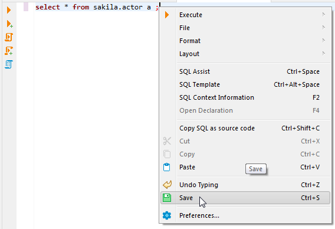
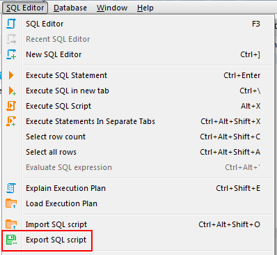
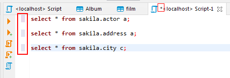
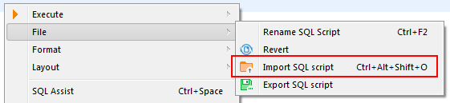
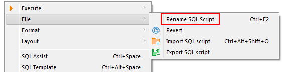
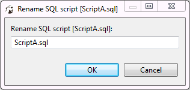

## Saving Scripts
You can save scripts to a predefined space in the currently active project or somewhere in the file system.

To save a script to the current project space, just press <kbd>Ctrl+S</kbd> or right-click the script and click **Save** on the context menu:

You can find the script saved this way in the [Project Explorer](Project-Explorer) view in the **Scripts** folder.

To save a script to the file system, right-click the script, click **File -> Export SQL script** on the context menu and then select the folder in the file system.
You can also click **SQL Editor -> Export SQL script** on the main menu:

Unsaved data is highlighted in color on the left side of the editor, in addition to having an asterisk in the name of the script.

## Loading Scripts
To load a script stored in the file system to the SQL Editor, press <kbd>CTRL+SHIFT+O</kbd>, or click **SQL Editor -> Import SQL script** on the main menu, or right-click the script panel and click **File -> Import SQL script** on the context menu:

## Renaming Scripts
To rename a script, right-click anywhere in the script panel, click **File -> Rename SQL Script** on the context menu or press <kbd>CTRL+F2</kbd>:

Then enter the new name in the Rename SQL script dialog box and click **OK**:

## Reverting Changes
If you want to revert all changes made to the current SQL script and return it to its initial state (reload from disk), right-click anywhere in the script panel and click **File -> Revert** on the context menu. 

## Changing default scripts directory
By default all of the scripts are saved to a "Scripts" folder located in your project inside the workspace directory. This can be changed by clicking the **Configure** button in [Project Explorer](Project-Explorer) view. There you can click on a folder's name an pick any other folder inside the Project.  
   
  

## Adding external directory
You can also link an external directory to your project to either save your scripts into it, or to access scripts that were created outside of DBeaver.  
To link an External directory right-click anywhere in the Project Explorer and pick **Create -> Link Folder**. There you can link any directory on your drive to a project. This will allow you to open any externally created scripts through Project explorer and to set this folder as default to save new scripts into.

## SQL Console
In some cases you might want to execute a query and not save it in a script. For example, when you read table data using "Read data in SQL console" or open procedure/function source from DDL editor.
SQL console does not have an associated .sql file. Its contents will be lost when you close it.
