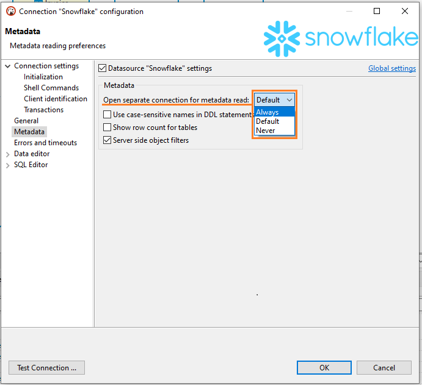

By default DBeaver creates separate connections for SQL Editor and Metadata read.

Opening separate metadata connection may increase performance because there will be no UI locks during query execution.

You can set up opening separate connection for metadata read globally in Preferences->Connections->Metadata or per each connection in Connection configuration->Metadata.

The setting to turn on/off opening separate connection for each editor is available in Preferences->Editors->SQL Editor and Connection configuration->SQL Editor and Connection configuration->Metadata.

That works for most databases except these:
- SQLServer Azure AD MFA
- BigQuery
- BigTable
- Spanner
- Apache Hadoop, Apache Drill, Apache Kyuubi, Apache Spark, Apache Hive, SnappyData, Gemfire XD, Apache Phoenix
- Redshift
- Snowflake

