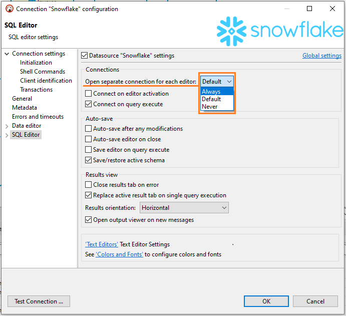

### Metadata

Opening separate metadata connection may increase performance because there will be no UI locks during query execution.

You can set up opening separate connection for metadata read globally in Preferences->Connections->Metadata or per each connection in Connection configuration->Metadata.

### SQL Editor

Opening separate connection for SQL Editor may allow you to have different execution context for each script.

You can set up opening separate connection for each editor in Preferences->Editors->SQL Editor and Connection configuration->SQL Editor and Connection configuration->SQL Editor.

### Default option
`Always` option means that DBeaver will create separate connections for SQL Editor and/or metadata read.

If you choose `Never` option, then DBeaver will use single connection - no new connections will be opened.

`Default` option means that DBeaver will create separate connections for SQL Editor and/or metadata read for most databases except these:
- SQLServer Azure AD MFA
- BigQuery
- BigTable
- Spanner
- Apache Hadoop, Apache Drill, Apache Kyuubi, Apache Spark, Apache Hive, SnappyData, Gemfire XD, Apache Phoenix
- Redshift
- Snowflake
