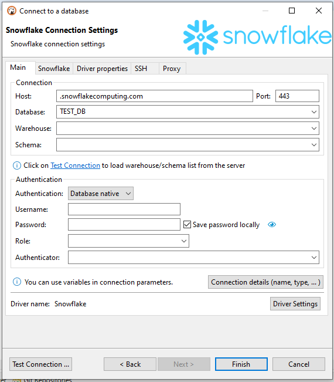
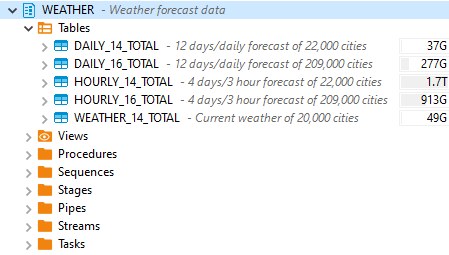
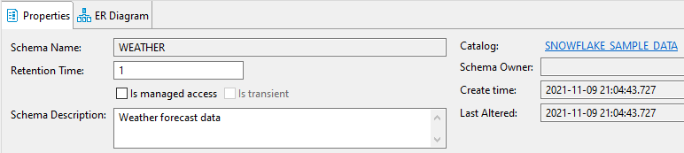

You can read more about the Snowflake database in the Snowflake [documentation](https://docs.snowflake.com/).

## Connecting to the Snowflake database.

There are several ways to configure a database connection.

Connection parameters

Parameter | Description | Example
----|-----|----
Host | Server host name | https://account.region.snowflakecomputing.com
Post number | Server listener port | 443 (default)
Database* | Database name | SNOWFLAKE_SAMPLE_DATA
Warehouse* | Cluster of compute resources in Snowflake. Warehouses are required for queries, as well as all DML operations, including loading data into tables | SNOWFLAKE
Schema* | Schema name | SAMPLE_DATA

*Click on the "Test Connection" button to load the warehouse/database/schema list from the server.

## Authentication

### Database

Parameter | Description | Example
----|-----|----
Username| Database user name | ADMIN
Password | Database user password | *****
Save password | Saves the user/password information in the local DBeaver configuration |
Role | Role for connection | SYS
Authenticator | Authenticator parameter/option | https://<okta_account_name>.okta.com

### Private key 

**Note: This feature is available in [Lite](Lite-Edition), [Enterprise](Enterprise-Edition), and [Ultimate](Ultimate-Edition) editions only.**

Parameter | Description | Example
----|-----|----
Username| Database user name | ADMIN
Private key | Path to encrypted or unencrypted private key | C:/Users/admin/Downloads/rsa_key.p8
Key Password | Private key password | *****
Save password | Saves the user/password information in the local DBeaver configuration |
Role | Role for connection | SYS

### SSO (Browser) 

**Note: This feature is available in [Lite](Lite-Edition), [Enterprise](Enterprise-Edition), and [Ultimate](Ultimate-Edition) editions only.**

Connection with the help of an external browser will be used.

Parameter | Description | Example
----|-----|----
Username| Database user name | ADMIN
Role | Role for connection | SYS

### DBeaver Profile 

You can use preconfigured connection profile here.

## Metadata

DBeaver provides an opportunity to view and manipulate such types of metadata:

- Databases
- Schemas
- Data types
- Tables
- Views
- Procedures and functions
- Sequences 
- Stages 
- Pipes 
- Streams 
- Tasks 

Table statistics are also available only in PRO DBeaver versions. As well as expanded metadata about tables and schemes.

