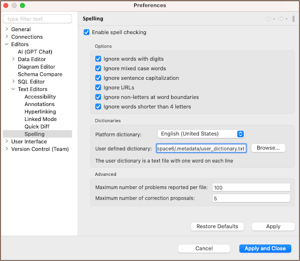
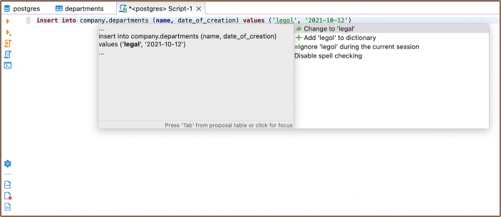

**Note: This feature is available
in [Lite](Lite-Edition), [Enterprise](Enterprise-Edition), [Ultimate](Ultimate-Edition)
and <a href="https://dbeaver.com/dbeaver-team-edition">Team</a> editions only.**

DBeaver's spelling function is a feature designed to detect spelling errors within script files. It allows you to upload
custom dictionaries in any language and provides advanced options for a more refined text management experience.

To open the settings for the spelling page, navigate through the following steps: **Preferences** -> **Editors** ->
**Text Editors** -> **Spelling**.

### Activation

The spelling function is enabled by default but can be customized to user requirements.

Disable the spelling function by unchecking the box next to **Enable spell checking** in Preferences.

### Usage

The spelling function is accessible in your SQL script files. Words that are not spelled correctly are underlined in
green, alerting you to potential inaccuracies.

To manage these incorrect words, open the context menu by right-clicking on the word or using the **Ctrl+1** (or **⌘1**
for Mac OS).

The context menu offers several options:

* Change the incorrect word with a suggested word.
* Add the word to the dictionary.
* Ignore the word during the current session.
* Disable spell checking entirely.

To apply any of these changes, you need to double-click on the chosen option with the left mouse button or press the
**Tab** key.

### Options

DBeaver's spelling settings provide specific options for this feature to tailor it to your needs.

 Option name                             | Description                                                          
-----------------------------------------|----------------------------------------------------------------------
 **Ignore words with digits**            | Skips words containing numbers.                                      
 **Ignore mix case words**               | Skips words with combined upper and lower case letters.              
 **Ignore sentence capitalization**      | Skips words starting with a lowercase letter at sentence beginnings. 
 **Ignore URLs**                         | Excludes web addresses from spell checking.                          
 **Ignore words shorter than 4 letters** | Disregards shorter words from spell checking.                        

### Custom Dictionaries

DBeaver includes an integrated English dictionary. However, you can choose to disable it and connect your custom
dictionary, or use both simultaneously, according to your needs.

In DBeaver's spelling settings you can add your own custom dictionary by specifying the path to it in the **User defined
dictionary** field. This dictionary should be a **.txt** file with one word per line.

If you want to disable the custom dictionary, clear the **User defined dictionary** field and apply the changes.

### Advanced Settings

You can adjust the **Maximum number of correction proposals**. This setting controls the number of suggested
substitutions that appear in the context menu for each misspelled word.

Also, you can specify the **Maximum number of problems reported per file**. This setting determines the total number of
words, starting from the first one, that the system will flag for replacement in each file.