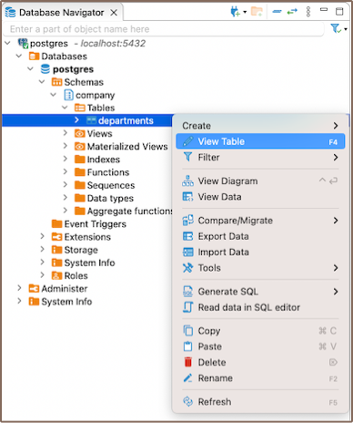

[<< New Table Creation](New-Table-Creation)
- Tables
- [Columns](https://github.com/dbeaver/dbeaver/wiki/Columns)
- [Constraints](https://github.com/dbeaver/dbeaver/wiki/Constraints)
- [Foreign Keys](https://github.com/dbeaver/dbeaver/wiki/Foreign-Keys)
- [Indexes](https://github.com/dbeaver/dbeaver/wiki/Indexes)
- [Triggers](https://github.com/dbeaver/dbeaver/wiki/Triggers)

### Create

To create a new table, navigate to the **[Database Navigator](Database-Navigator)**, select the necessary database, right-click on **Tables**
and choose **Create New Table** from the context menu.  

  

In the **[Properties editor](Properties-Editor)**, you will have the opportunity to define the table's
name, [constraints](Constraints), [foreign keys](Foreign-Keys), [indexes](Indexes), [triggers](Triggers), and explore
other functionalities.  

#### Important

The changes are not saved automatically. To save the changes, select the desired table in the **Database Navigator** and
press <kbd>Ctrl+S</kbd> (or <kbd>CMD+S</kbd> for Mac OS). Then, choose **Persist** to save the changes.  

  

**Additionally**, to save changes, you have two options:

* Click on **File** and select **Save**.
* Utilize the **Save** button  located at the bottom of the **[Editor panel](Data-Editor)**.

### Modify

To make adjustments, navigate to the **Properties** editor. Access this by right-clicking the
table's name in the **Database Navigator** menu and selecting **View Table**.  

  

### Delete

To delete a table, right-click on the table's name in the **Database Navigator** and select **Delete**.  

  

**Tip**: Be cautious with the **Cascade delete** option, as it can lead to unintended consequences.

 [<< New Table Creation](https://github.com/dbeaver/dbeaver/wiki/New-Table-Creation) | [Columns >>](https://github.com/dbeaver/dbeaver/wiki/Columns)

