## Creating tasks
The task is a saved configuration of a database tool. It can be started from the task management view or from the menu by a single click.
You can create tasks for frequently used tools.
Also, tasks can be [[scheduled|Task Scheduler]] for regular execution.

### Create a task from tool configuration
You can save the tool configuration into a task and run your task later with a single click.
For example, you can start [[Data Transfer]] wizard and configure the data export from several tables in the SQLite database into CSV files:

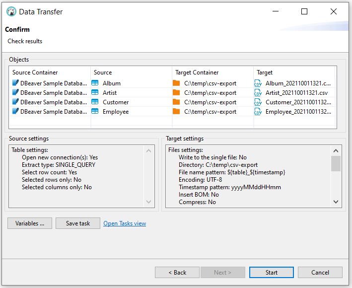

Click on the `Save configuration as task` button and fill the task properties:

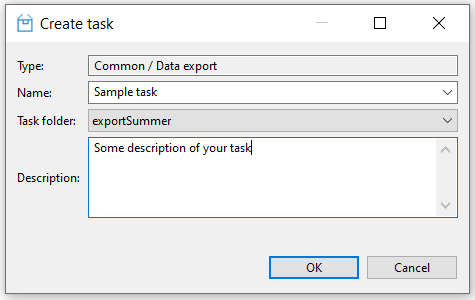

Now click on the `Open Tasks view` link to open the task list:

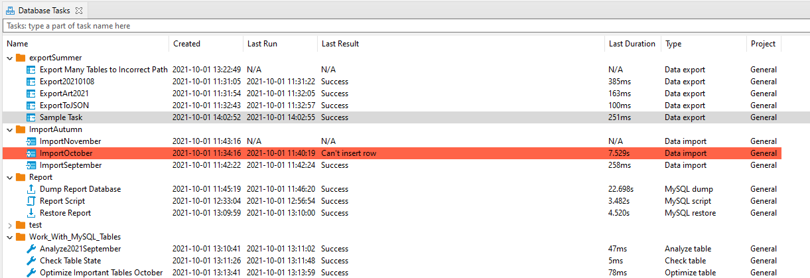

You can configure Database Tasks View to see more or fewer View columns. Use right-click inside the Database Tasks tab and choose the `Configure columns` button from the menu.

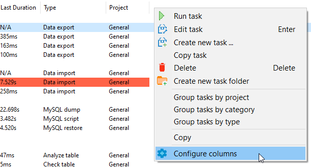

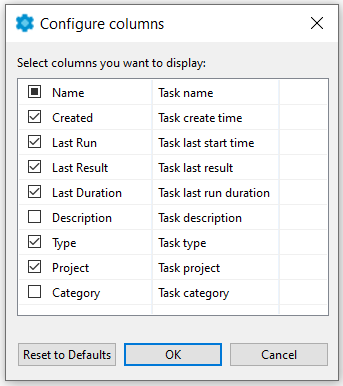

Also, you can create a new task from the main menu `Database -> Tasks -> Create new task...`.

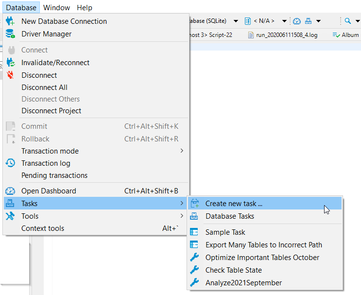

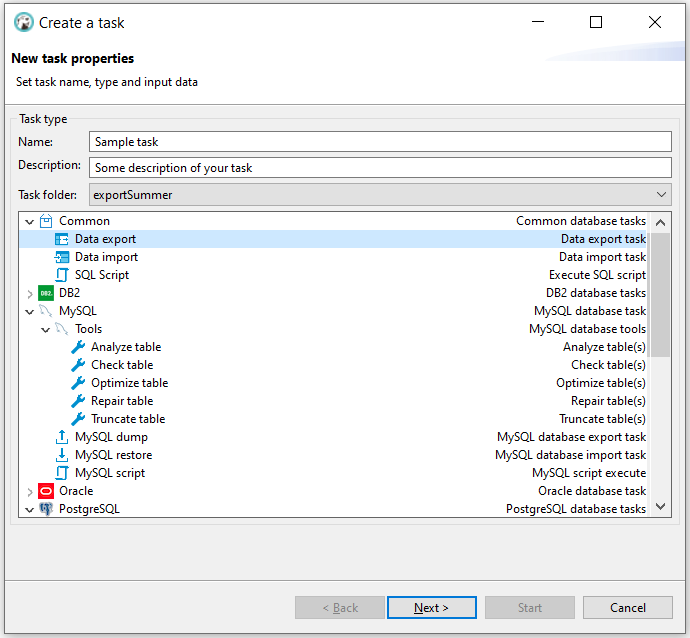

### Editing/running tasks

From the task view you can add, edit, remove and execute saved tasks.
You can use the context menu or view tools for that:

By clicking on `Edit` or by double-clicking on a task you can open the tasks edit wizard. In this wizard, you can change the task settings as well (use button `Back`) as the actual tool configuration. You can change the set of input objects for data transfer or any export configuration. After changing the task settings, click on the `Save task` button (it is on the last page of the task configuration wizard).

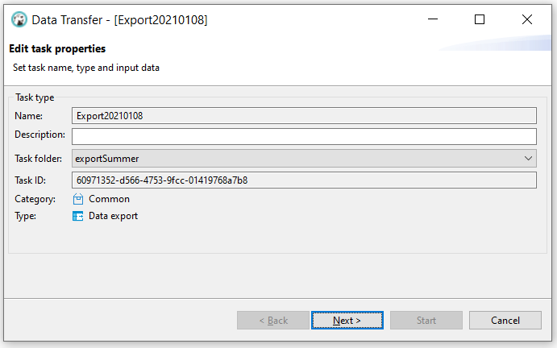

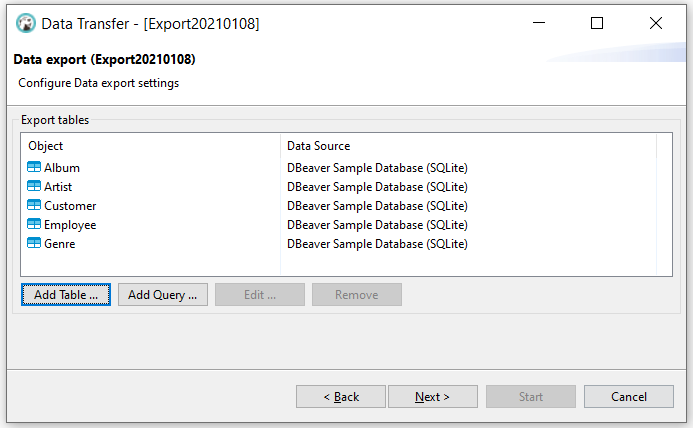

### Create a task from task management view
You can create a task from scratch using the tasks view. Open tasks view and click on the  `Create new task` button in the View toolbar or in the context menu.
In the task wizard, you can choose the task category, task type, task folder, and name. On the next wizard pages, actual tool configuration pages will be shown (they depend on the chosen task type).

### Tasks folders

For better structuring, you can store your tasks in folders. Create folder can also be from the context menu Database Tasks View.

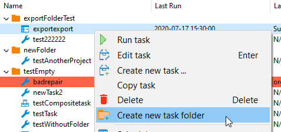

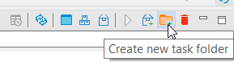

You can choose a project for the new task folder and add a new unique name.

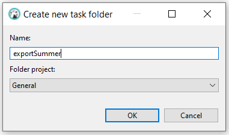

You can change the task folder for an existing task in the task Edit dialog (use button `Back`). Or you can drag your task to another task folder in the View.

Task folder as a task can be deleted with the button `Delete`.

### Scheduling tasks

You can schedule tasks for later/regular execution. See the [[Task Scheduler]] article.
