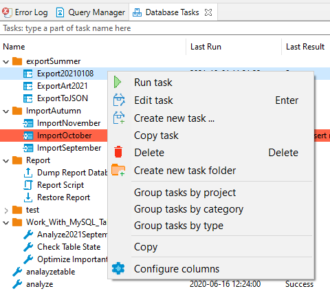

## Creating tasks
Task is a saved configuration of some database tool. It can be started from task management view or from menu by a single click.
You can create tasks for frequently used tools.
Also tasks can be [[scheduled|Task Scheduler]] for regular execution.

### Create task from tool configuration
You can save tool configuration into a task and run your task later with a single click.
For example you can start [[Data Transfer]] wizard and configure data export from several tables in MySQL database into CSV files:

Click on `Save configuration as task` button and fill task properties:

Now click on `Open Tasks view` link to open task list:

### Editing/running tasks

From task view you can add, edit, remove and execute saved tasks.
You can use context menu or view tools for that:

By clicking on `Edit` or by double-clicking on task you can open tasks edit wizard. In this wizard you can change task settings as well as actual tool configuration. You can change set of input objects for data transfer or any export configuration. After changing task settings click on `Update configuration in task` button (it is on the last page of task configuration wizard).

### Create task from task management view
You can create task from scratch using tasks view. Open tasks view and `Create new task` button in the view toolbar or in the context menu.
In task wizard you can choose task category, task type and name. On the next wizard pages actual tool configuration pages will be shown (they depend on chosen task type).

### Scheduling tasks

You can schedule tasks for later/regular execution. See [[Task Scheduler]] article.
