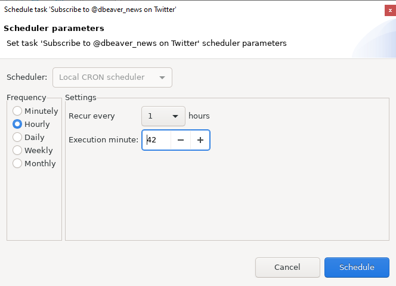

**Note: This functionality is available only in [Enterprise Edition](Enterprise-Edition).**

DBeaver can schedule task execution for regular executions. 
DBeaver supports `Windows Task Scheduler` on Windows and `cron` on macOS and GNU/Linux. 
On top of that as well, you can configure schedulers manually 
[using command line](#running-tasks-from-the-command-line).

### Scheduling tasks from the Tasks view
You can open the tasks view from the main toolbar:

or from the main menu Window.
Select a task that you want to schedule in the tasks view and open the context menu:

The scheduler configuration dialog will be opened. 
It differs a little depending on the operating system you use. 
On Windows, you can configure task frequency, recurrence period, and start time there:

Unfortunately, there are a bit fewer settings on macOS and GNU/Linux due to the limitations of cron. For example, 
when configuring hourly task, you can only choose the minute at which the task executes. 
In the example below, the task executes at 1:42 PM, 2:42 PM, 3:42 PM, and so on:

To schedule the task, click on the Schedule button. If everything is configured correctly 
you will see the confirmation dialog:

If anything goes wrong you will see an error message dialog. 
Error details can be viewed in the [Error Log](Log-files) view.

You can change scheduler settings at any moment by choosing Edit scheduled task command 
from the context menu. You can also cancel scheduling by clicking on Remove schedule.

### See schedule details and logs in the Windows Task Scheduler

You can see and change scheduled task details in the Windows Task Scheduler. 
Click on the Open scheduler settings command in the task view context menu:

All DBeaver tasks are located in a folder DBeaver.

### See schedule details for cron

You can take a look at the crontab DBeaver uses to schedule tasks in `cron`
by clicking the 'Open scheduler settings' command in the task view context menu. 
You can also do it in the terminal by using the command `crontab -l`. 
Although you can also edit the crontab by using `crontab -e`, we strongly do not recommend it.

### Monitoring for task execution

You can look through the task execution logs on the right side of the tasks view. 
By double-clicking on a task run item you can see the full log with all details, errors, and warnings:

DBeaver keeps the task run logs in the [workspace](Workspace-Location) directory, 
subfolder .metadata/task-stats.

### Running tasks from the command line

The task scheduler uses the DBeaver [command line](Command-Line) interface to perform task execution. 
Command line parameter `-runTask TASK_ID` launches saved task execution (immediately).  
TASK_ID has form `@projectName:taskName`. 
You can omit project name part if you have only one project in your workspace.
Use `dbeaver-cli` executable to run tasks.  
Draw your attention that if you use `dbeaver` executable (by any reason) 
you will need to add command line parameter `-nosplash` to avoid splash screen appearance.
