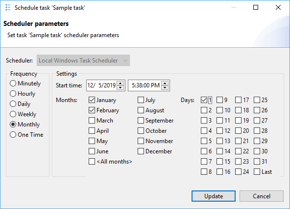

**Note: This functionality is available only in [Enterprise Edition](Enterprise-Edition).**

DBeaver can schedule task execution for regular executions.
DBeaver supports `Windows Task Scheduler` on Windows and `cron` on macOS and GNU/Linux.
On top of that as well, you can configure schedulers manually
[using command line](#running-tasks-from-the-command-line-any-os).

## Scheduling tasks from the Tasks view
### Windows
You can open the tasks view from the main toolbar:

or from the main menu Window.
Select a task that you want to schedule in the tasks view and open the context menu:

The scheduler configuration dialog will be opened. You can configure task frequency,
recurrence period, and start time there:

To schedule the task, click on the Schedule button. If everything is configured correctly
you will see the confirmation dialog:

If anything goes wrong you will see an error message dialog.
Error details can be viewed in the [Error Log](Log-files) view.

You can change scheduler settings at any moment by choosing Edit scheduled task command
from the context menu. You can also cancel the schedule by clicking on Remove schedule.

### macOS or GNU/Linux
The first thing you need to open the tasks view. There are three ways to do that:

1. Database -> Tasks -> Database Tasks  
   

1. Window -> Database Tasks  
   

1. Click on 'Show View (Database Tasks)' icon  
   

Select a task that you want to schedule in the tasks view. To open the scheduler dialog, either:

1. Open context menu with right-click -> Scheduler -> Schedule task  
   

1. or click on 'Schedule task' icon  
   

The scheduler dialog will be opened. It has a lot of similarities with the corresponding dialog on Windows, but
unfortunately, there are a bit fewer settings on macOS and GNU/Linux due to the limitations of `cron`.
For instance, when configuring an hourly task, you can only choose the minute at which the task executes.
In the example below, the task executes at 1:42 PM, 2:42 PM, 3:42 PM, and so on:

There is also no start date option, and, in case of minutely tasks, no start time either. The scheduler will execute the task at the specified recurrence, but there are no guarantees about when execution starts.
It's also worth pointing out that even though you can specify seconds in the start time selector,
they will be ignored. Most cron implementations do not support this type of granularity,
and we are trying to be compliant with as many cron implementations as possible.

On macOS 10.15 or newer, when scheduling a task for the first time you will be prompted with
something like this:

Click 'Yes' to proceed. The reason for that prompt is that `cron` settings (crontabs) are considered
to be system settings by macOS, and DBeaver won't be able to change them without permission.

After that, if everything is configured correctly you will see the confirmation message.
Just like on Windows, you can change scheduler settings at any moment by choosing
'Edit scheduled task' command from the context menu, or cancel schedule by clicking on 'Remove schedule'.

## See schedule details
### Windows
You can see and change scheduled task details in the Windows Task Scheduler.
Click on the Open scheduler settings command in the task view context menu:

All DBeaver tasks are located in a folder DBeaver.

### macOS or GNU/Linux
You can take a look at the crontab DBeaver uses to schedule tasks in `cron`
by clicking the 'Open scheduler settings' command in the task view context menu.
You can also do it in the terminal by using the command `crontab -l`.
Although you can also edit the crontab by using `crontab -e`, we strongly do not recommend it.

## Monitoring for task execution (any OS)
You can look through the task execution logs on the right side of the tasks view.
By double-clicking on a task run item you can see the full log with all details, errors, and warnings:

DBeaver keeps the task run logs in the [workspace](Workspace-Location) directory,
subfolder .metadata/task-stats.

## Running tasks from the command line (any OS)
The task scheduler uses the DBeaver [command line](Command-Line) interface to perform task execution.
Command line parameter `-runTask TASK_ID` launches saved task execution (immediately).
TASK_ID has form `@projectName:taskName`.
You can omit the project name part if you have only one project in your workspace.
On Windows, you can use `dbeaver-cli` executable to run tasks.
Draw your attention that if you use `dbeaver` executable (by any reason)
you will need to add command line parameter `-nosplash` to avoid splash screen appearance.

## Troubleshooting
### Windows Task Scheduler: incorrect date format
If you encounter an error on Windows which looks like this: 
`ERROR: Invalid Start Date (Date should be in %some_format% format).`,

do the following:

1. Open file `dbeaver.ini` in the directory with your DBeaver installation
1. Place the line `-Ddbeaver.scheduler.windows.dateFormat=%some_format%` (where %some_format% is a format from the error message) below the `-vmargs` line.

This flag is available starting from the 7.3.4 EA version of DBeaverEnterprise and might be removed in the future.