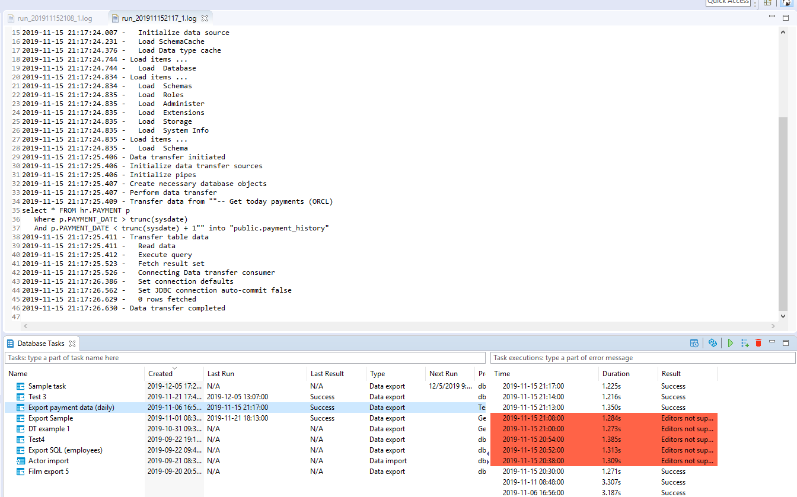

**Note: This functionality is available only in the [DBeaver Enterprise Edition](Enterprise-Edition).**

DBeaver can schedule an execution for regular tasks.
DBeaver supports `Windows Task Scheduler` on Windows and `cron` on macOS and GNU/Linux.
In addition, you can manually configure schedulers
[using command line](#running-tasks-from-the-command-line-any-os).

## Scheduling tasks from the Tasks view
### Windows
You can open the tasks view from the main toolbar:

or from the main menu Window.
Select a task that you want to schedule in the tasks view and open the context menu:

The scheduler configuration dialog will be opened. You can configure task frequency,
recurrence period, and start time there:

To schedule the task, click on the Schedule button. If everything is configured correctly,
you will see the confirmation dialog:

If anything goes wrong, you will see an error message dialog.
Error details can be viewed in the [Error Log](Log-files) view.

You can change the scheduler settings at any moment by choosing Edit scheduled task command
from the context menu. You can also cancel the schedule by clicking on Remove schedule.

### macOS or GNU/Linux
You first need to open the tasks view. There are three ways to do that:

1. Database -> Tasks -> Database Tasks  
   

1. Window -> Database Tasks  
   

1. Click on 'Show View (Database Tasks)' icon  
   

Select a task you want to schedule in the tasks view. To open the scheduler dialog, either:

1. Open the context menu with right-click -> Scheduler -> Schedule task  
   

1. or click on the 'Schedule task' icon  
   

The scheduler dialog will be opened. It has a lot of similarities with the corresponding dialog in Windows, but
unfortunately, there are a fewer settings on macOS and GNU/Linux due to the limitations of `cron`.
For instance, when configuring an hourly task, you can only choose the minute at which the task is to be executed.
In the example below, the task executes at 1:42 PM, 2:42 PM, 3:42 PM, and so on:

There is also no start date option, and, in case of minutely tasks, no start time either. The scheduler will execute the task at the specified time, but there are no guarantees about when the execution will start.
It is also worth pointing out that even though you can specify the seconds in the start time selector,
they will be ignored. Even though we try to be compliant with as many cron implementations as possible, most cron implementations do not support this type of granularity.

On macOS 10.15 or newer versions, when scheduling a task for the first time you will be prompted with
something like this:

Click 'Yes' to proceed. The reason for that prompt is that the `cron` settings (crontabs) are considered
to be system settings by macOS, and DBeaver will not be able to change them without your permission.

After that, if everything is configured correctly you will see the confirmation message.
Just like in Windows, you can change the scheduler settings at any moment by choosing the
'Edit scheduled task' command from the context menu, or cancel the schedule by clicking on 'Remove schedule'.

## See schedule details
### Windows
You can see and change the scheduled task details in the Windows Task Scheduler.
Click on the Open scheduler settings command in the task view context menu:

All DBeaver tasks are located in a folder called `DBeaver`.

### macOS or GNU/Linux
You can take a look at the crontab DBeaver uses to schedule tasks in `cron`
by clicking the 'Open scheduler settings' command in the task view context menu.
You can also do it in the terminal by using the command `crontab -l`.
Although you can also edit the crontab by using `crontab -e`, we strongly do not recommend it.

## Monitoring for task execution (any OS)
You can look through the task execution logs on the right side of the tasks view.
By double-clicking on a task run item you can see the full log with all details, errors, and warnings:

DBeaver keeps the task run logs in the [workspace](Workspace-Location) directory,
subfolder .metadata/task-stats.

## Running tasks from the command line (any OS)
The task scheduler uses the DBeaver [command line](Command-Line) interface to perform task executions.
Command line parameter `-runTask TASK_ID` launches saved task executions (immediately).
TASK_ID has the form `@projectName:taskName`.
You can omit the project name part if you have only one project in your workspace.
In Windows, you can use `dbeaver-cli` executable to run tasks.
Please note that if you use `dbeaver` executable (for any reason),
you will need to add the command line parameter `-nosplash` to avoid a splash screen appearance.

## Troubleshooting
### Windows scheduler overview
There are two implementations of Windows scheduler present:
1. CLI-based (**Legacy**): uses `schtasks.exe` to communicate with the scheduler; sensitive to locale-dependent data, such as unicode names, date-time format.
2. COM-based (**New**): uses COM API to communicate with the scheduler; more flexible and provides more features than CLI version.
   
COM-based implementation is used by default starting from the 21.1 version of DBeaver EE.

### Windows Task Scheduler: COM exception
#### Non-legacy scheduler only
If you encounter an error in Windows which contains the following text: `com.sun.jna.platform.win32.COM.COMException`,

do the following:
1. Open the file `dbeaver.ini` in the directory with your DBeaver installation
1. Place the line `-Ddbeaver.scheduler.windows.legacy=true` below the `-vmargs` line. 

### Windows Task Scheduler: incorrect date format
#### Legacy scheduler only
If you encounter an error in Windows which looks like this: 
`ERROR: Invalid Start Date (Date should be in %some_format% format).`,

do the following:

1. Open the file `dbeaver.ini` in the directory with your DBeaver installation
1. Place the line `-Ddbeaver.scheduler.windows.dateFormat=%some_format%` (where %some_format% is a format from the error message) below the `-vmargs` line.

This flag is available starting from the 7.3.4 EA version of DBeaverEnterprise and might be removed in the future.

### macOS 10.15+: Unable to read or write to crontab

When scheduling tasks on macOS 10.15 or newer versions, the OS will prompt you to elevate DBeaver's permissions to administer your computer.
If you do not grant these permissions, DBeaver will fail to schedule your tasks with an error `Unable to read or write to crontab`.
To bypass this, simply restart DBeaver and try to schedule the task again. You will be prompted to elevate the permissions again.
If you were never prompted to do that in the first place, you can grant `Full disk access` permissions in the macOS settings. Here is how to do that:

1. Open `System Preferences`.
1. Click on `Security & Privacy`.
1. Choose the `Privacy` tab.
1. Choose the `Full Disk Access` folder.
1. Unlock the preferences lock to the bottom if it is locked.
1. Click the + button.
1. Select DBeaverEE in the file picker that opens.
1. Click `Open`.
1. Close the lock.