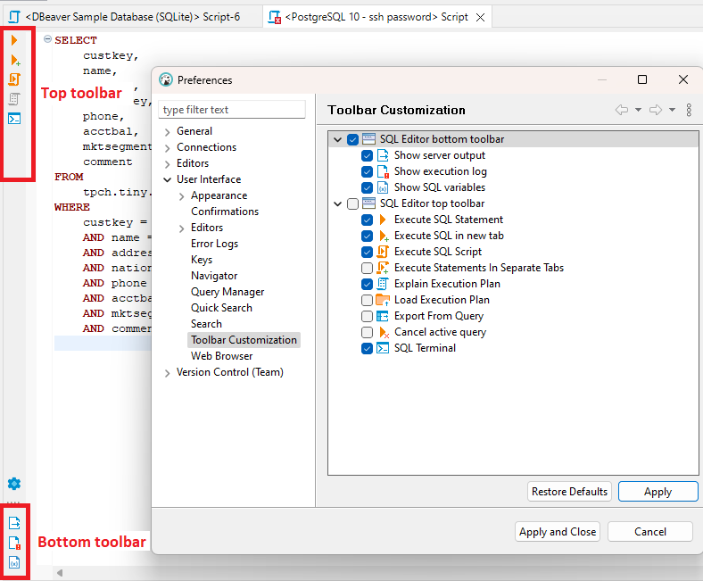

# Toolbar Customization
You can customize your SQL Editor toolbar to bring more commands with `Preferences->User Interface->Toolbar Customization`.

By default, only Execute SQL Statement, Execute SQL Script and Explain Execution plan are visible.

