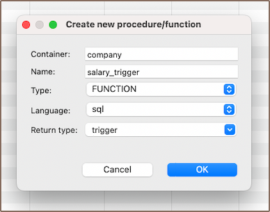
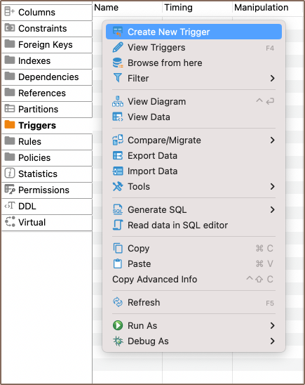
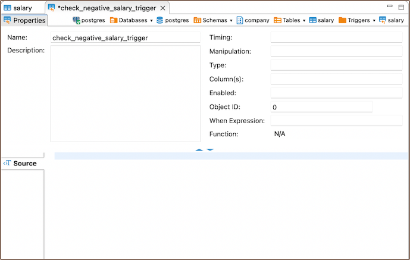
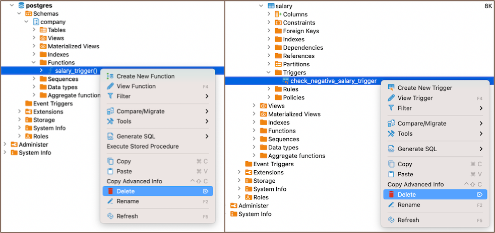

### Create

#### Function

1) To create a trigger, start by creating a function. Navigate to the **Functions** section in the **[Database Navigator](Database-Navigator)**.
   Right-click to open the context menu and select **Create New Function**.

   

2) Choose the function name, type, language, and return type (trigger) for your new function.

   

3) In the **Source** section, write the function that will be called when the trigger is activated.

   

For example:

```sql
BEGIN
    IF NEW.salary_amount < 0 THEN
        RAISE EXCEPTION 'Error: Salary cannot be negative';
    END IF;
    RETURN NEW;
END;
```

#### Trigger

1) Once you've created the function, create the trigger. Navigate to the **Triggers** section in the **[Properties editor](Properties-Editor)**
   of the relevant table. Right-click on the screen and select **Create New Trigger**.

   

2) In the opened window, choose the trigger's name and the function to be used.

3) Finally, describe the code for the trigger.

   

For instance:

```sql
CREATE TRIGGER check_negative_salary_trigger
BEFORE INSERT
ON company.salary
FOR EACH ROW
EXECUTE function company.salary_trigger();
```
4) Persist the changes.


In this example, a `salary_trigger()` function is created that evaluates the new salary value (NEW.salary). If the
salary is negative, it throws an exception with an error message. Then, a `check_negative_salary_trigger` is established
to run this function before any `INSERT` or `UPDATE` operations on the "salary" table. Should the salary value be
negative,
an exception is triggered and the operation is stopped.

### Modify

1) To modify a function or trigger, navigate to the **Database Navigator**.

2) In the relevant sections, select the function or trigger you want to change.

    

3) Then, click **View Function** for functions or **View Trigger** for triggers. This action opens the selected item in
   an editable
   format.

### Delete

To delete a function or a trigger, navigate to the **Database Navigator**. Here, you will find sections for both
functions and triggers.



Locate the function or trigger you want to delete within the relevant section and select either **Delete** from the
context menu, or you can select the necessary function or trigger and press the <kbd>Delete</kbd> key.

### Restrictions

* Recursive Triggers: Some databases allow recursive triggers, where a trigger can call itself. This can lead to
  infinite
  loops and excessive system load if not handled correctly.
* Data Modification: Triggers can't be used to modify a table that is already being used (for reading or modifying) in
  the
  statement that invoked the function or trigger.
* Execution Order: The order in which multiple triggers are fired isn't guaranteed. This can lead to unexpected results
  if
  triggers have interdependencies.
* Performance: Triggers can slow down data modification operations because they add extra processing. They should be
  used
  sparingly and optimized for performance.
* Transaction Control Statements: In many SQL databases, transaction control statements (like COMMIT and ROLLBACK) are
  not
  allowed within trigger code. However, exceptions apply depending on the database system.

**Note**: these limitations can vary based on the specific SQL database system you are using, such as PostgreSQL, MySQL,
Oracle, SQL Server, etc. Always refer to the specific documentation for your database system to understand its unique
foreign keys behavior.