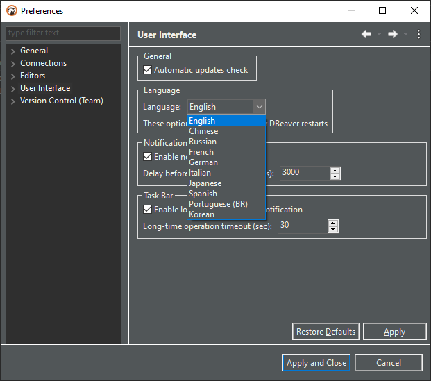

### Changing interface language in Preferences

Go to Preferences->User Interface:



Select language in the drop-down list ant click "Apply and Close" button 

### Changing interface language in configuration file

Locate `dbeaver.ini` file, it is the same directory where DBeaver is installed.

Open `dbeaver.ini` in a text editor and add the following lines before the line `-vmargs` 
```
-nl
XX
```

where XX is two-letter language code:

Language | Code
---|---
English | en
Chinese | zh
French | fr
Italian | it
Japanese | jp
German | de
Korean | ko
Portuguese (BR) | pt_BR
Russian | ru
Spanish | es
