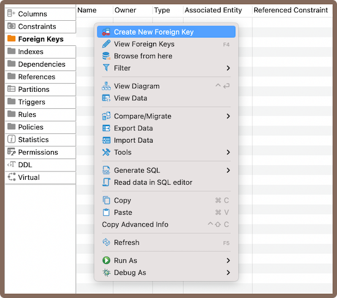
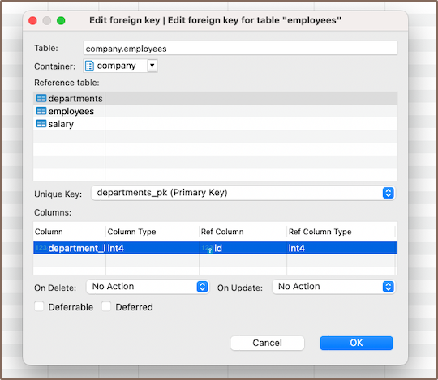
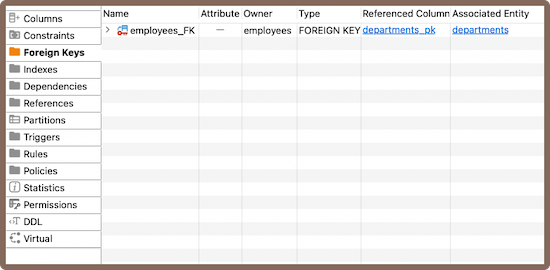
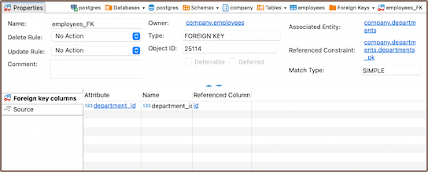
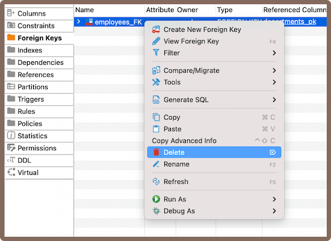

This article provides a comprehensive guide on the creation and management of Foreign Keys within DBeaver. While not
always necessary, foreign keys can be used to establish relationships between [tables](New-Table-Creation), which can help maintain data
consistency and integrity.

In DBeaver, the creation of a foreign key involves referencing a [unique key](Implementing-Constraints#unique-key) in another table. This process forms a
relationship that is essential for maintaining data integrity. Additionally, DBeaver allows you to define specific rules
for the behavior of foreign keys when deleting or updating rows in the main table.

This guide will detail the steps involved in creating, modifying, and deleting foreign keys. It will also explain how to
set up rules for their behavior. It is important to note that the management of foreign keys requires careful
consideration due to their significant impact on data relationships.

### Create

Creating a new foreign key in DBeaver involves a series of steps that guide you through the process. 

1) You can start the process of creating a new foreign key in three ways:
- Using the **[Properties editor](Properties-Editor)**: Open the Properties Editor and navigate to the **Foreign Keys**
   tab of the corresponding table.

     

- Using the **[Database Navigator](Database-Navigator)**: Navigate to the database where the table you want to add a
  foreign key to is located. Find and select the table for which you want to create a new foreign key. Within the
  selected table, you'll find a folder named **Foreign Keys**. 
- Additionally, to create a new foreign key, you can utilize the **Create New Foreign Key**
  button  located at the bottom of the **Properties editor**.

2) Depending on the method you chose in step 1, either right-click on the window (in the **Properties Editor**) or within
   the **Foreign Keys** folder (in the **Database Navigator**), and select **Create New Foreign Key**. If you're using 
   the third method, simply click the **Create New Foreign Key** button. This will open a new window where you'll be able
   to customize the foreign key's settings to suit your needs.  

   

 Field                    | Description                                                                                                                                                                                                                                                                                 
--------------------------|---------------------------------------------------------------------------------------------------------------------------------------------------------------------------------------------------------------------------------------------------------------------------------------------
 **Reference table**      | Select the table that the foreign key references.                                                                                                                                                                                                                                           
 **Unique Key**           | Choose the unique key in the reference table that the foreign key will point to.                                                                                                                                                                                                            
 **Columns**              | Select the columns in your table that will become the foreign key.                                                                                                                                                                                                                          
 **Deferrable**           | Specify whether the enforcement of the foreign key constraint can be deferred until the end of the transaction.                                                                                                                                                                             
 **Deferred**             | If the foreign key is deferrable, this option sets whether the constraint is deferred by default.                                                                                                                                                                                           
 **On delete/on update:** | Set the actions that will be taken when the referenced data is deleted or updated. The options are **No Action**, **Cascade**, **Restrict**, **Set NULL**, and **Set Default**.                                                                                                             
 **- No Action**          | This option means that if the referenced data is deleted or updated, no action will be taken. However, if such a change would result in a violation of the foreign key constraint, the change will be disallowed.                                                                           
 **- Cascade**            | If the referenced data is deleted or updated, the same action will be applied to all rows holding a foreign key that points to that data. For example, if a row in the referenced table is deleted, all rows in the table with the foreign key that point to that row will also be deleted. 
 **- Restrict**           | This option disallows the deletion or updating of referenced data. If any foreign keys reference the data, the change will be disallowed.                                                                                                                                                   
 **- Set Null**           | If the referenced data is deleted or updated, all foreign keys that reference it will be set to `NULL`.                                                                                                                                                                                     
 **- Set Default**        | If the referenced data is deleted or updated, all foreign keys that reference it will be set to their default values. If no default value is specified, this option behaves the same as **No Action**.                                                                                      

3) After hitting **OK**, a window displaying the newly created foreign key will appear.  

   

#### Saving changes

Once you have configured the foreign key properties, it is essential to save these changes to the database. Until you
commit your modifications, the new foreign key will only exist within DBeaver and will not be added to the actual database
table.
Here are three options for committing the changes:

* Click on **File** -> **Save** -> **Persist**.
* Select the desired table in the **Database Navigator** and press <kbd>Ctrl+S</kbd> (or <kbd>CMD+S</kbd> for Mac OS),
  choose **Persist** to save the changes.
* Utilize the **Save** button  located at the bottom of the
  **Properties editor** and press **Persist** to save the changes.

### Modify

Over time, you may need to adjust the properties of your foreign keys. This could involve renaming a foreign key,
changing its referenced table or unique key, adjusting its columns, or updating its rules for deletion or update.
DBeaver allows you to make these modifications as needed. Here's how:

- **Properties Editor**: Open the Properties Editor by double-clicking on the table name. Within the selected table, you'll find a
  folder named **Foreign Keys**. Right-click on the foreign key you want to modify and select **View Foreign Key**.
- **Database Navigator**: In the Database Navigator, select the appropriate database and table. Within the selected table, you'll find a
  folder named **Foreign Keys**. Right-click the foreign key and select **View Foreign Key**.
- **Bottom Menu**: In the **Properties Editor** interface, use the **View Foreign Key**
  button  to open the properties of the selected foreign key in the
  **Editor panel**.

   

### Delete

1) You can delete a foreign key either through the **Properties Editor** or the **Database Navigator**:

- Using the **Properties Editor**: Open the Properties Editor, navigate to the **Foreign Keys** tab of the corresponding table,
  and find the foreign key you want to delete.

   

- Using the **Database Navigator**: Navigate to the database where the table with the foreign key is located. 
  Open the **Foreign Keys** folder, and find the foreign key you want to delete.

2) To delete a foreign key, right-click on the key's name and select **Delete**, or you can select the necessary foreign
   key and press the <kbd>Delete</kbd> key, or **Delete button**  (in the
   **Bottom Menu** of the **Properties Editor**).
3) A confirmation dialog will appear, asking you to confirm the deletion. Before proceeding, ensure that you've selected
   the correct foreign key for deletion.
4) After confirming the deletion, you'll need to persist the changes to apply them to the database.

### Restrictions

* **Referential Integrity**: Foreign keys enforce referential integrity. The values in the foreign key column must
  match those in the referenced primary key.
* **No Circular References**: Circular foreign key references are not permitted in most databases where two or more
  tables refer to each other.
* **Delete and Update Operations**: Deleting or updating rows from the referenced table can be complicated because of the
  need to preserve referential integrity.
* **Schema Modifications**: Changes to the schema of a table (like altering data types or column deletions) can be
  restricted if a foreign key references the table.

    
**Further Reading:** 
[New Table Creation](New-Table-Creation) | [Creating columns](Creating-columns) | [Implementing Constraints](Implementing-Constraints) | Utilizing foreign keys | [Creating indexes](Creating-Indexes) | [Incorporating triggers](Incorporating-Triggers)