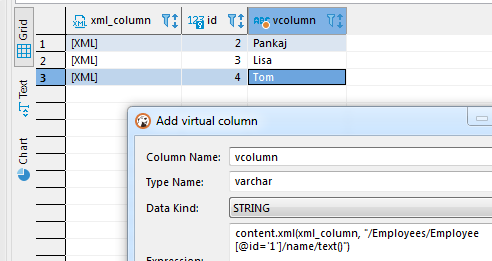

## Expression language

You can use standard JavaScript-like expression language. DBeaver uses the Jexl engine to process expressions.  
Language references and examples can be found here: http://commons.apache.org/proper/commons-jexl/reference/syntax.html

## Column values

All columns' values in the current result set can be referred to by name.
Expression `column1 + column2` will produce the sum of two numeric columns or concatenation of two string columns `column` and `column2`.

## Standard functions

Standard functions are declared in namespaces.  
You can refer to the functions in the namespaces as variables - `nsName.functionName(parameters`).

### math

You can access all math functions as `math.function(parameters)`.  
You can find all supported math functions here: https://docs.oracle.com/cd/E12839_01/apirefs.1111/e12048/functmath.htm

### geo

Function | Parameters | Description
---|---|---
wktPoint|(longitude, latitude)|Produces WKT (geometry) point out of two coordinates. Default SRID is 4326.
wktPoint|(longitude, latitude, srid)|Produces WKT (geometry) point out of two coordinates and SRID

### content

If you have JSON or XML columns in your table, you can add a virtual column with an expression for these columns.

Use content.json(<columnName>)[parameter1][parameter2] pattern to create expression for JSON column.
Example: content.json(column1)['glossary']['GlossDiv']['title']
You can read more about JSON parameters in the link on the top. 

Use content.xml(columnName, "expression") or content.xml(columnName, "returnType", "expression") patterns to create expression for XML column.
Quotation is important for parsing processes.
XML expression can return types: string, number, boolean, node, nodeset - all these types can be used (!in quotes) for return data type clarification. content.xml(columnName, "expression") returns string by default
Example: content.xml(column1, "nodeset", "/Employees/Employee[gender='Female']/name/text()")
You can read more about XPath here: https://en.wikipedia.org/wiki/XPath

