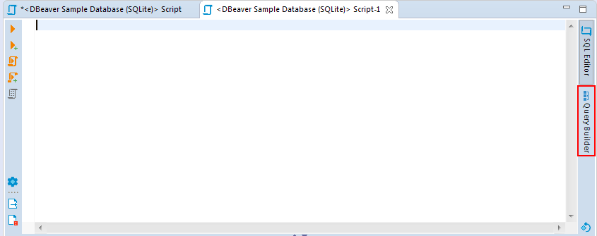
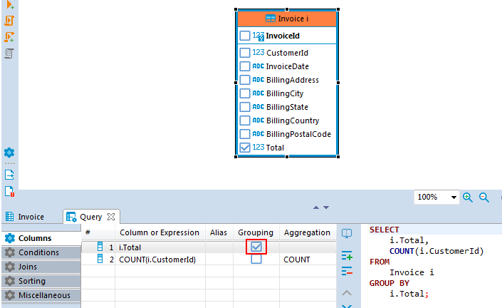
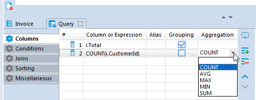

**Note: This feature is available in [Lite](Lite-Edition), [Enterprise](Enterprise-Edition), and [Ultimate](Ultimate-Edition) editions only.**

**Query Builder** is a user-friendly visualization tool that will help you make sense of your complex database designs. It can be useful when you need to understand the various relationships between different tables. Also, it can be helpful for those who are not very familiar with SQL scripting or if you do not want to insert script commands manually. The tool creates SQL scripts automatically based on the visual schema you have created. 

## Opening Visual Query Builder 

To open **Visual Query Builder** click the **Open Query Builder** button in the [SQL Editor](SQL-Editor) tool bar. 

The **Visual Query Builder** will appear on the right.

## Creating Visual Query

Start creating a query by selecting a query data source: drag-and-drop tables you want to work with from the **Database Navigator** pane into the **Visual Query Builder** area. All the connections existing between the tables will be shown automatically.

To create a new join between the tables, press the left mouse button when the cursor is over the column of one table, holding the right mouse button drag the cursor to the column of another table and release the right mouse button. The connection between the selected columns of the tables will be created visually and in the SQL script a new join will be added. 

To remove a join between the tables, click on it. The connection will be highlighted. Then, press<kbd>Delete</kbd> or use the **Delete** option in the context menu. The visual connection will be removed and the corresponding join will be automatically removed from the SQL script area.  

To build a SELECT query you need to select columns in the tables you added. To select a column, click the check-box next to its name - the column will be added to the **Columns** tab of the **Query Settings Editor** and SELECT query will be added to the SQL script area automatically.

## Adjusting Query Settings

**Visual Query Builder** also allows you to set the query conditions and adjust the representation of query results by means of **Query Settings Editor**.

To open **Query Settings Editor** use **Visual builder query settings** button  in the vertical tool bar on the left.

**Query Settings** window contains five tabs described below.

### Columns

**Columns** tab of the **Query Settings Editor** contains all the columns you added by selecting column names in **Visual Builder** main window. In this tab you can add and remove columns using **Add** and **Remove** buttons correspondingly.
 
To add a column, press **Add** button  and a new instance will be added to the table. Click on the first cell in **Column or Expression** column and select a column from the list of available columns displayed in the dropdown list appeared. 

To remove a column, click on the row containing its name and press the **Remove** button  on the right.

To change the display order of columns in the result table use **Move Up/Down** buttons .

You can also define a user-friendly name of the column to be displayed in the result table. To set a user-friendly name, click on a cell in **Alias** column and insert the name. The change will be immediately displayed in the SQL script area. 

If you want a **grouping** condition to be added to your expression, you can click on the checkbox in the column row. The expression will update automatically. The other previously selected columns will become aggregate. If there are no other columns, then the expression COUNT(*) will be automatically added.

You can select other aggregation functions from the drop-down list. Or enter your own version in the cell.

When removing columns from the list, they will be removed from the grouping expression as well. When adding new columns to the list, it is added to the grouping expression.

### Conditions

The **Conditions** tab is used for managing query conditional expressions.

To add a new conditional expression, use the **Add** button  on the right - a new instance will be added and the default conditional expression WHERE will be added to the SQL script area automatically. This default conditional expression can then be adjusted to the one you need:

* **Left Operand** setting defines the left operand of the conditional expression. To set the left operand, click the cell in the **Left Operand** column and a drop down list of all available  columns will be displayed. Select a column you want to use as the left operand in your conditional expression or insert a digit. 

* **Operation** setting defines the comparison rule between the left and the right operands of the conditional expression. To set a comparison rule, click the cell in the **Operation** column and select the rule you need from the drop down list which will appear.

* **Right Operand** setting defines the right operand of the conditional expression. To set the right operand, click the cell in the **Right Operand** column and a drop down list of all available columns will be displayed. Select a column you want to use as the left operand in your conditional expression or insert a digit. 

To remove a conditional expression, click on the row containing the expression and press the **Remove** button  on the right. 

### Joins

All the joins existing between the tables in **Visual Query Builder** main window are displayed in the **Joins** tab of **Query Settings Editor**.

Joins cannot be  added or removed by means of **Query Settings Editor**, however, the following join settings can be adjusted here: 

* **Type** - defines the type of the join. Click the cell in the **Type** column - a drop down with available join types will be displayed. Select the required option  from the list by clicking on it.

* **Alias** - defines a user friendly name of the join. To define this setting click on the cell in the **Alias** column and input the name.

### Sorting

In the **Sorting** tab you can set the order of rows in the result table.

 

To add a new sorting condition press  the **Add** button  on the right and the default conditional expression ORDER BY will be added to the SQL script area automatically. This default conditional expression can then be adjusted to the one you need:

* Once a new condition is added, click the first cell in **Conditions or Expressions** column and a drop down list of all available columns will appear. Select the required column by clicking on its name. 

* In the **Order** column you can define whether the rows of the selected column should be sorted in ascending or descending order in the result table. To set the order, click the cell in **Order** column and select the required option from.The order by command will be added to the script. 

To remove a condition use the **Remove** button  on the right. 

### Miscellaneous

In the **Miscellaneous** tab it is possible to:
 
* Enable or disable the automatic generation of aliases for tables by selecting the **Add table aliases** check-box.
* Disable auto-completion for table names by selecting the **Use fully qualified table names** check-box.
* Enable Autosave on SQL-editor switch by selecting the **Autosave on SQL-editor switch** check-box. 

 

## Executing Visual Query

To execute a query, use the **Execute SQL statement** button   to get the results in the same tab or **Execute SQL statement in new tab** button  to get the results in a new tab. Both buttons are located in the **Visual Query Builder** vertical toolbar.
