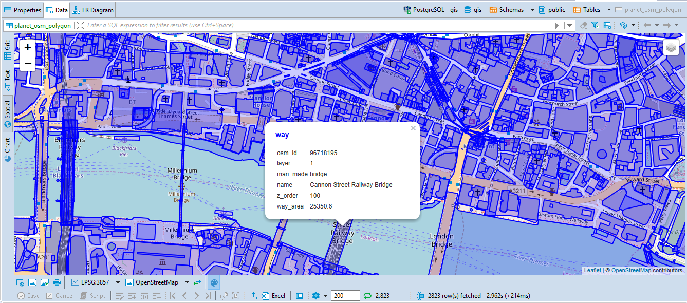
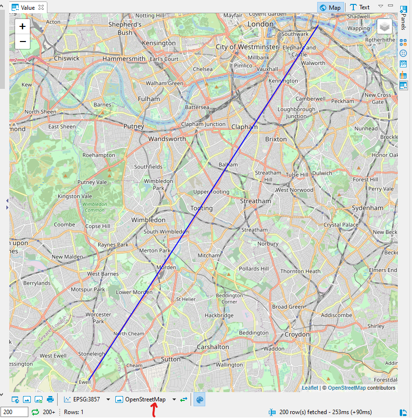
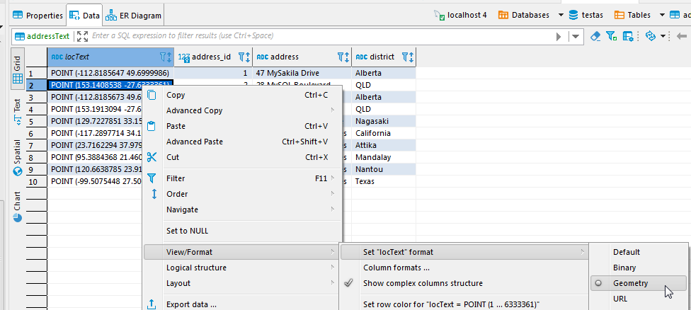
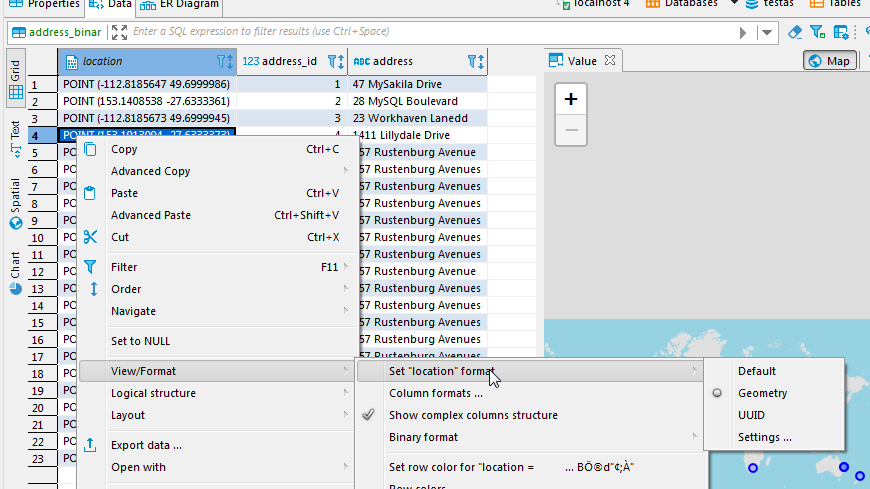

Spatial data is a geometry or geography value that can be represented on a map or a graph. A geometry object consists of a series of points. [Please find more details here](https://en.wikipedia.org/wiki/Spatial_database).  

DBeaver's support of spatial data covers the following databases:
- PostgreSQL (PostGIS)
- MySQL
- SQLite (GeoPackage)
- H2GIS
- SAP HANA
- Oracle 
- SQL Server 

## Spatial data viewer

 <!--CMD:SKIP-->

### Differentiating data on the map
Every column in the table has it’s own color on the map. This helps you find needed information on the map if you know which column it belongs to.

If you click on the object on the map the following information will be displayed:
1. Name of the column in the header
2. Displayable data (Strings, numbers, dates etc.) from every other column in the corresponding row

### Tile layer management
DBeaver ships with several predefined map tiles. The tiles can be chosen with the combo below the viewer:

You can choose which tile layers you want to see in the combo in the _manage_ dialogue.
In the same manage dialogue, you can add new tile layers, edit layers you previously added, 
or delete them.

### Defining custom tile layer
At this point, you may be wondering what to put in the Layers definition box. Here is a brief explanation.

DBeaver's spatial data viewer uses Leaflet (version 1.4.0 at the moment) under the hood. 
When providing Layers definition, you type the arguments for function L.tileLayer(), 
which installs a new tile layer. [More on that](https://leafletjs.com/reference-1.4.0.html#tilelayer) 
function in the official Leaflet documentation. You can also see the definition of
predefined tiles to help you get started.  

## Viewing string or binary data from any Database on a map 

You can also see your geodata on the map if you select the data cell setting "View/Format", then "Set columnName format" and among the formats - Geometry. 
This works for both string and binary types of columns.

String column type to spatial.

Binary column type to spatial.

## Additional features

### Copying coordinates

You can copy coordinates to clipboard from any point of the map, just right-click anywhere and select “Copy coordinates”. It copies the coordinates formatted as `latitude, longitude` to the clipboard.\
**NOTE:** The coordinates are copied according to EPSG:4326 CRS and are just raw numbers. You may need to remove a comma and switch latitude and longitude places to correctly insert it into a database.

### Miscellaneous buttons

You can use buttons at the bottom of the view for additional features:
* Open the generated temporary HTML file in your default browser.
* Copy a current map to clipboard as picture
* Save a current map as picture into a selected folder
* Print a current map
* Flip latitude and longitude coordinates in source data. This can be useful if the data in your table is saved in (latitude longitude) format while Leaflet reads it as (longitude, latitude). This button doesn’t change anything in source data, it just changes how this data is read to show accurate information on the map.

 
