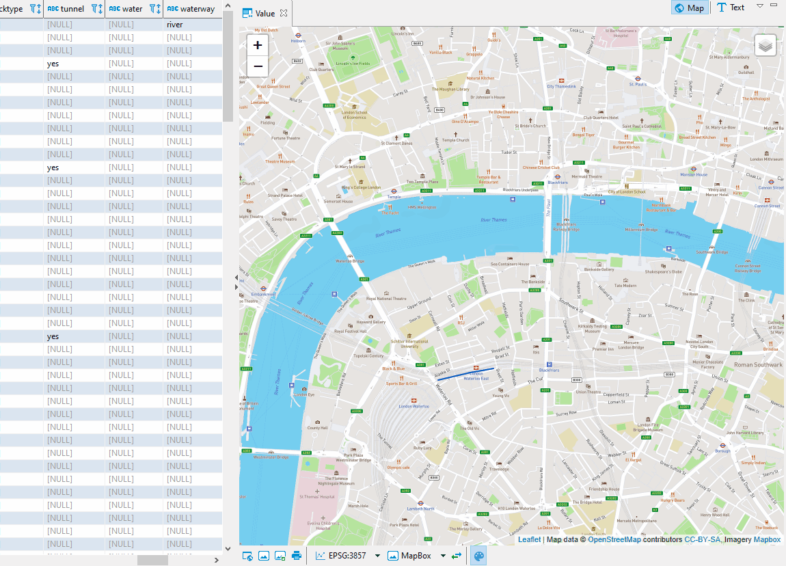

Spatial data is a geometry or geography value that can be represented on a map or as a graph. Geometry object consists of series of points. [More details](https://en.wikipedia.org/wiki/Spatial_database).

DBeaver's support of spatial data covers the following databases:
- PostgreSQL (PostGIS)
- MySQL
- SQLite (GeoPackage)
- H2GIS
- SAP HANA
- Oracle 
- SQL Server 

## Spatial data viewer

### Tile layer management
DBeaver ships with several predefined map tiles. Tiles can be chosen with the combo below the viewer:

You can choose which tile layers you want to see in the combo in the _manage_ dialogue:

In the same manage dialogue, you can add new tile layers, edit layers you added previously, 
or delete them:

### Defining custom tile layer
At this point, you may be wondering what to put in the Layers definition box. Here is a brief explanation.

DBeaver's spatial data viewer uses Leaflet (version 1.4.0 at the moment) under the hood. 
When providing Layers definition, you type the arguments for function L.tileLayer(), 
which installs a new tile layer. [More on that](https://leafletjs.com/reference-1.4.0.html#tilelayer) 
function in the official Leaflet documentation. You can also see the definition of
predefined tiles to help you get started.  

## Viewing string or binary data from any Database on a map 

You can also see your geodata on the map if you select the data cell setting "View/Format", then "Set columnName format" and among the formats - Geometry. 
This works for both string and binary types of columns.

String column type to spatial.

Binary column type to spatial.