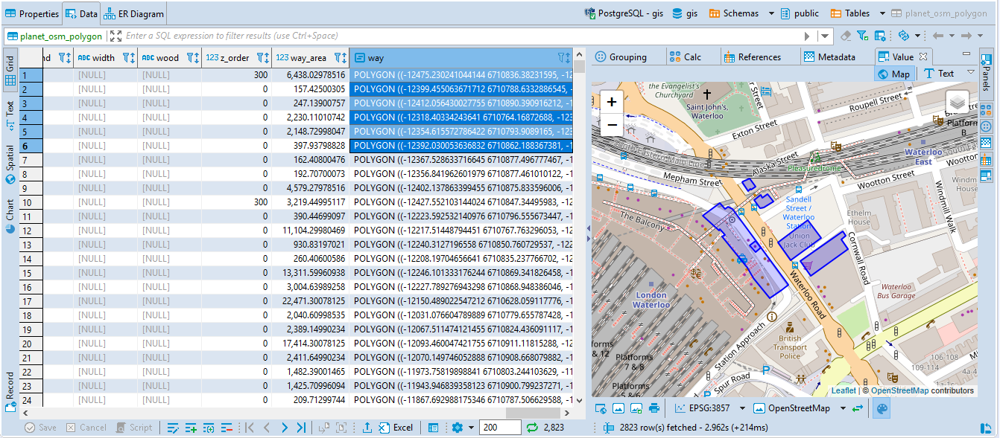

## Spatial data

Spatial data is geometry or geography value which can be represented on a map or as a graph. Geometry object consists from a series of points. <a href="https://en.wikipedia.org/wiki/Spatial_database">More details</a>.

## Spatial data viewer

## Converting longitude/latitude to geography points

Generally any combination of longitude/latitude (as float point numbers) can be represented as geometry value.

## Supported databases

- PostgreSQL (PostGIS)
- MySQL
- Oracle
- SQL Server
- H2GIS
