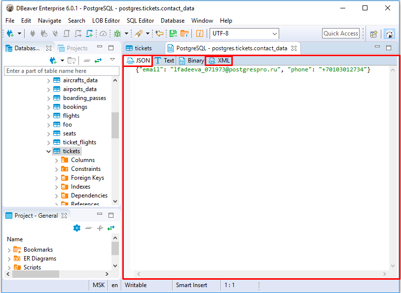
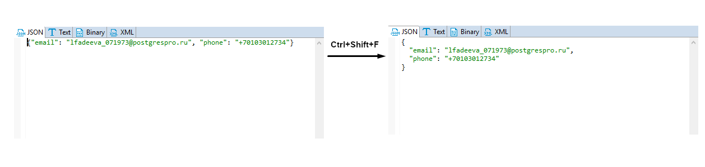
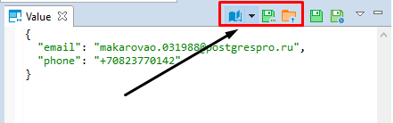
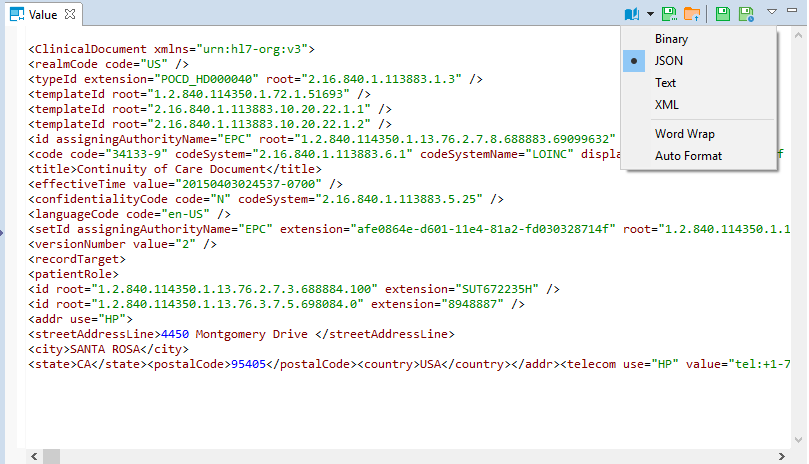
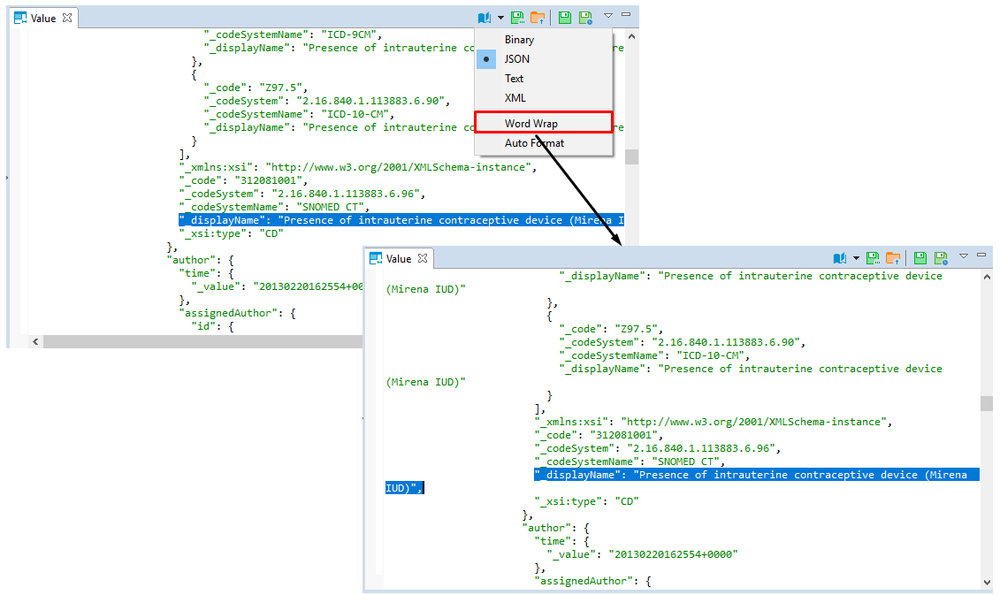
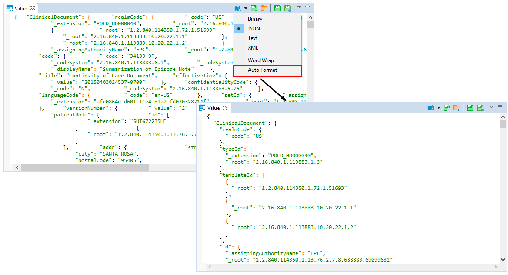

DBeaver supports XML and JSON column types (in relational databases) by using standard JDBC interfaces. This feature was added in JDBC4 so you will need JDBC4 compliant driver for your database.

In the Data Editor, you can edit XML/JSON data right in the table cells, however, a big amount of data may require a larger editor, you may want to save XML/JSON scripts to a local file or upload this type of data from a local file.

To open the full-size XML/JSON editor click the cell containing data in XML/JSON format and press <kbd>Shift</kbd>+<kbd>Enter</kbd>. 

By default the editor opens on JSON tab, open XML tab to modify XML data.

To auto-format XML/JSON script press <kbd>Ctrl</kbd>+<kbd>Shift</kbd>+<kbd>F</kbd> keyboard buttons.

Use <kbd>Ctrl</kbd>+<kbd>S</kbd> keyboard shortcut to save the changes made.

You can also edit XML/JSON content, save it locally and upload it from a local file with the help of **Value** panel toolbar. 

To upload data from a local file, press the **Load from file...** button .

To save the content to a local file, press the **Save to file...** button.

To switch between the formats, press the **Content viewer settings** button  and select the format.

Use **Word Wrap** feature that wraps the text within a screen.

Use **Auto-format** feature to automatically change the appearance of XML/JSON script (fix spaces around operators / commas, fix indentation, etc) and make it more readable.

