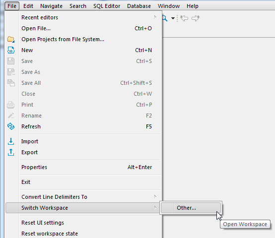
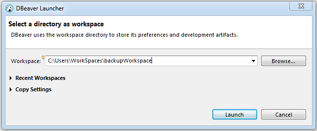

The DBeaver window contains a menu bar, a toolbar, a shortcut bar, a workspace with one or more editors and views, and a status line:

# Menu Bar
By default, the menu bar contains the following menus:

* **File** menu contains menu items for the creation of files, folders, projects, database connections, database projects, and ER diagrams as well as Import and Export items.  
* **Edit** menu contains global commands like Cut, Copy, Paste, and Delete targeted at the active element.
* **Navigate** menu allows navigating through scripts and database objects.
* **Search** menu provides options to search among files, database objects, and across data.
* **SQL Editor** menu is for opening SQL Editor and managing its appearance.
* **Database** menu allows you to manage database drivers, connections, and transactions as well as reconnect to and disconnect from a database.
* **Window** menu includes items to manage the look of the DBeaver window: show/hide and minimize/maximize views and editors, display bars, split editors, and manage other preferences.
* **Help** menu contains links to information and help resources, as well as menu items to check the version number and availability of updates.

You can customize the menu bar and the list of menu items to display - this is done on **Window -> Customize Perspective -> Menu Visibility** tab.

# Toolbar
The toolbar contains buttons for basic and most frequently used commands:

Some of the buttons are enabled (colored), others are disabled (greyed). The sets of enabled and disabled buttons change depending on which editor is currently active in the workbench. Only enabled buttons are applicable to the active editor.

You can customize the toolbar - this is done on **Window -> Customize Perspective -> Tool Bar Visibility** tab. 

You can hide or show the toolbar in the application window. To do it, on the Window menu, click **Appearance -> Hide  Toolbar / Show Toolbar**.

# Shortcut Bar
There are two shortcut bars - on the left and on the right side of the workspace zone. Shortcut bars host shortcuts of views and editors and appear if at least one view or editor is minimized, otherwise, they are hidden.

# Views
Views are windows within the workspace that provide presentations and ways to navigate the information.
Views can appear as separate windows or as tabs stacked with other views in a tabbed window.
You can change the layout of the workspace by opening and closing views, docking them in different positions in the workspace, collapsing them to the shortcut bar, or expanding them to occupy the whole workspace and restoring to the latest docked position.  

The following are parts of a view: 

## Opening Views
To open a view:
* On the Window menu, click **Show View** and then, on the submenu, click the name of the view.
* For Database Navigator, Projects, and Project Explorer views, on the Window menu, just click the name of the view.

Some views open together with editors or on-demand, for example, the Error Log view opens when an error occurs.

## Changing Views Layout
You can move views around the workbench and dock them in different positions:
* As a tab in a tabbed window
* As a separate window with a vertical or horizontal layout in any zone of the workspace

You can also swap locations of two views.

To dock a view to a position in the workspace, press and hold the title bar of the view, then drag and drop it onto the desired position.  

## Maximizing Views
To maximize a view to the size of the whole workspace, do one of the following:
* Click the Maximize button in the upper-right corner of the view.
* Double-click the title bar of the view.
* On the Window menu, click **Appearance -> Maximize Active View or Editor**.

When one view is maximized, other views appear as shortcuts on the shortcut bar.

To restore a maximized view to its latest docked position, double-click its title bar. 

## Minimizing Views
When you minimize a view, it wraps into a shortcut on the shortcut bar:

The shortcuts of views and editors may appear on the left or on the right shortcut bar depending on the latest docked position of the view or editor.

To minimize a view, do one of the following:
* Click the Minimize button in the upper-right corner of the view.
* On the Window menu, click **Appearance -> Maximize Active View or Editor**.

To restore a minimized view to its previous position, on the shortcut bar, click the Restore button of the view or editor. To restore a minimized view to a new position, click the view/editor name button under the restore button.

## Switch workspace

The current workspace for DBeaver can be switched by using the File -> Switch Workspace command. If you have already switched your workspace previously the previous workspaces will be available for selection in the Switch Workspace menu.

The Switch Workspace --> Other... menu item will open the switch workspace dialog. The dialog will allow you to browse for or manually enter a new workspace location. The combo will also allow you to select your previously selected workspaces. 

